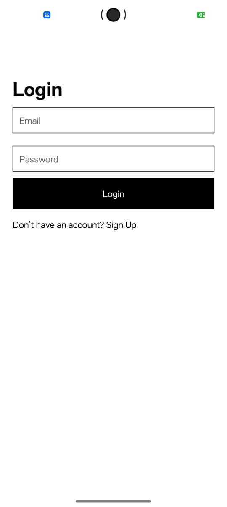
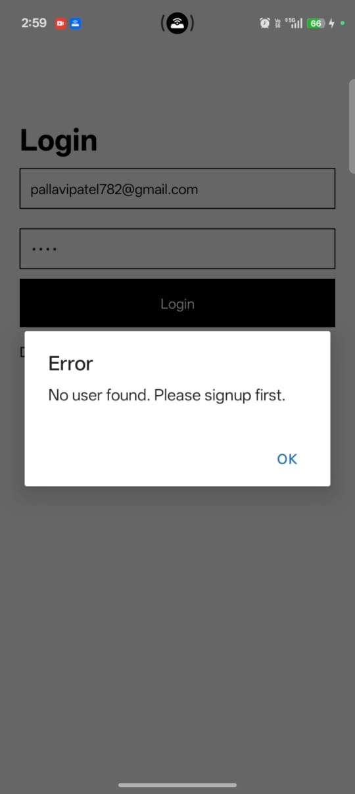
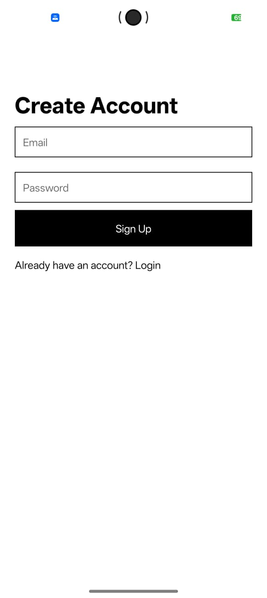
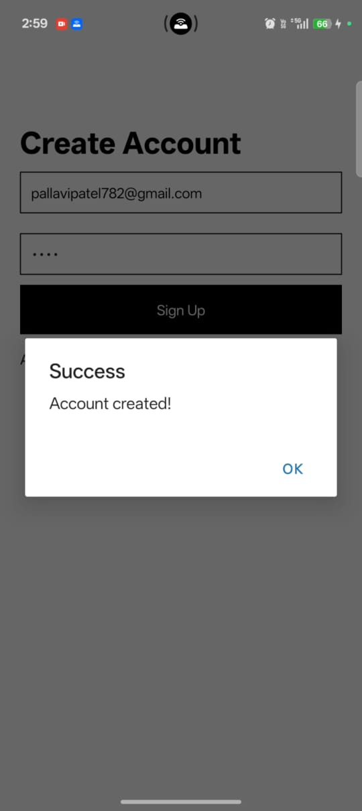
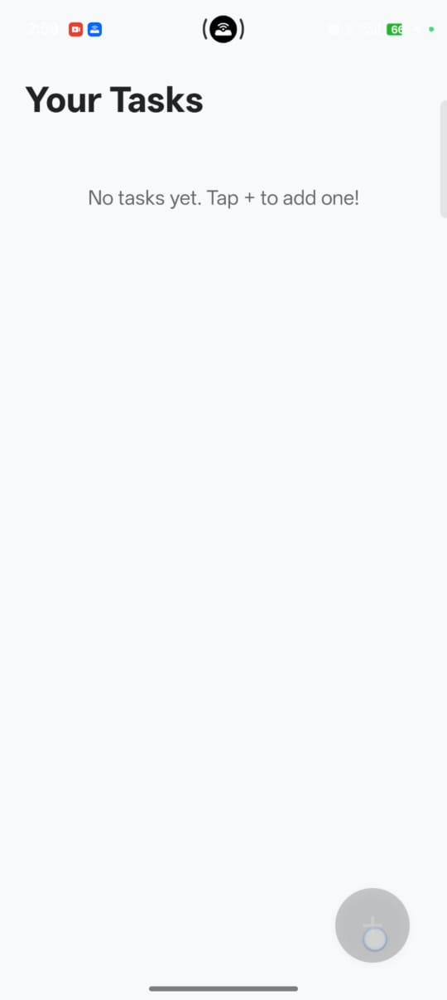
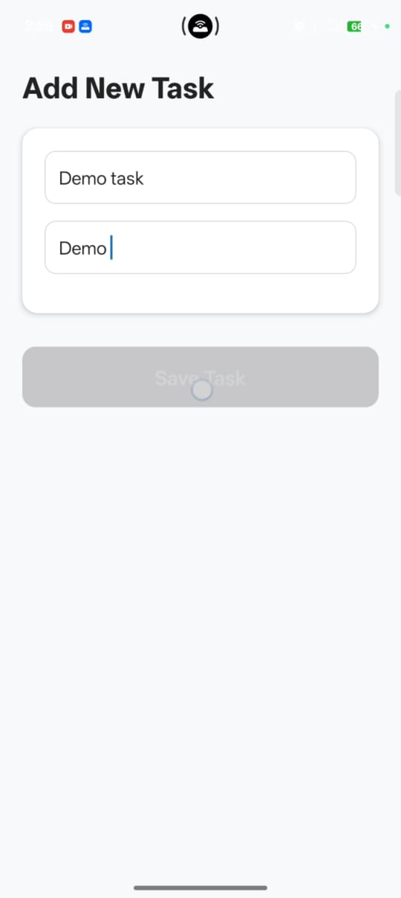
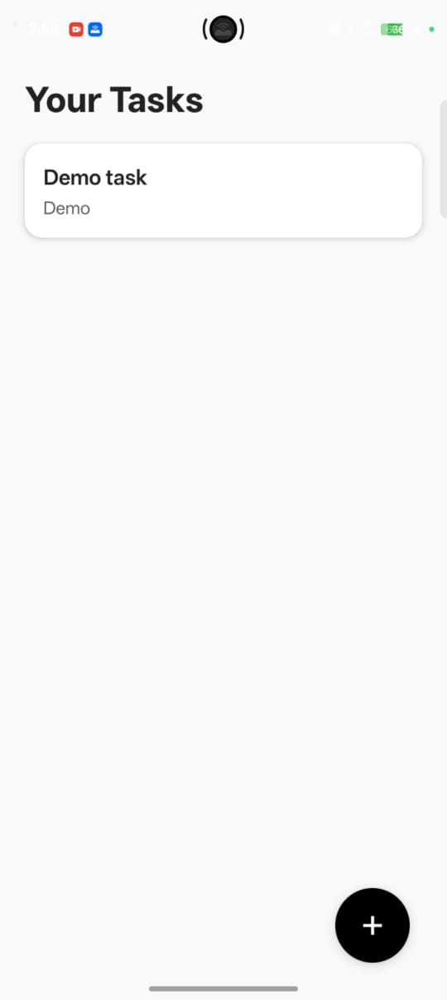
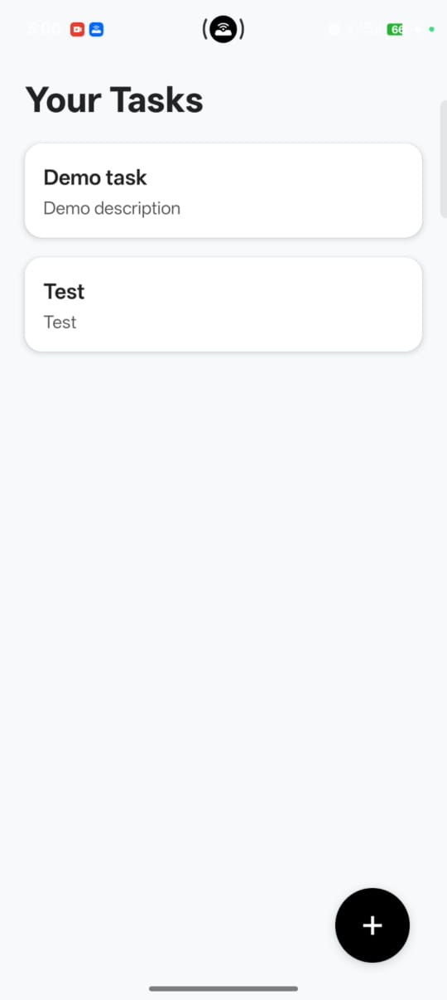
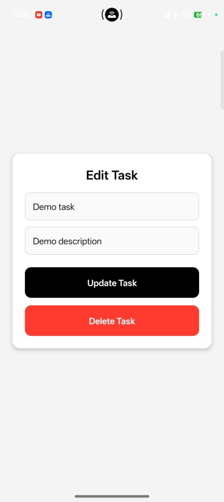

# Task Management App 📱

A simple and clean task management app built using **React Native + Expo**.

---

## 📥 Download APK

Click below to download the Android APK:

➡️ **[Download ToDo App APK](https://github.com/Pallavi122001/TaskManagement/releases/download/v1.0.0/application-c7127bec-af26-473b-80d9-a07d89131127.apk)**

---

## 📸 Screenshots

<p align="center">
 
 
 
 
 
 
 
 
 
</p>

---

## 🚀 Getting Started

### Install dependencies
```bash
npm install
